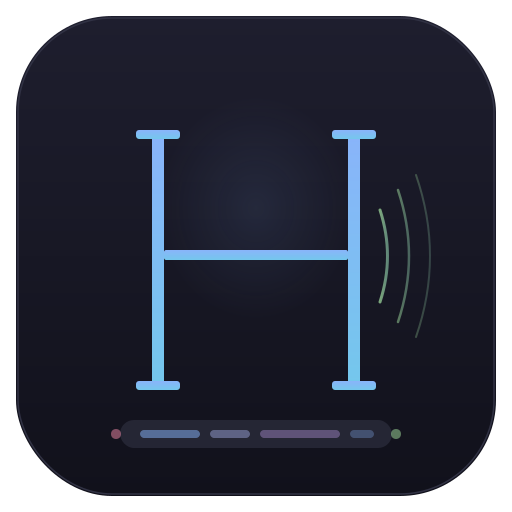

<p align="center">
  
</p>

# Hermes

**Real-time translated subtitles for iPhone Mirroring on macOS.**

Hermes captures audio from any app running through iPhone Mirroring -- TikTok, YouTube, Instagram, WeChat, anything -- transcribes it with Whisper, translates it with NLLB-200, and displays floating subtitles directly over the mirrored window. Everything runs locally on Apple Silicon. No API keys, no internet required after setup.

---

## How it works

```
iPhone (any app)
    │  iPhone Mirroring
    ▼
ScreenCaptureKit ──► 16kHz PCM chunks ──► Python microservice
                                              │
                                    Whisper STT (mlx-whisper)
                                              │
                                    NLLB-200 translation
                                              │
                                              ▼
                                    Floating subtitle overlay
```

The Swift menu bar app captures audio from the iPhone Mirroring window via ScreenCaptureKit, sends 2-second PCM chunks to a local FastAPI service, and renders the translated text in a click-through NSPanel overlay pinned to the bottom of the mirroring window.

## Requirements

- macOS 15+ (Sequoia) with iPhone Mirroring
- Apple Silicon Mac
- Python 3.10+
- ~6 GB disk for models (downloaded on first launch)

## Setup

```bash
cd translator_service
pip3 install -r requirements.txt
```

Build the Swift app with Xcode or from the command line:

```bash
xcodebuild -project Hermes.xcodeproj -scheme Hermes -configuration Debug build
```

## Usage

Launch the app. It starts the Python translation service automatically, loads models (~15 seconds on first run), then shows a waveform icon in the menu bar. Open iPhone Mirroring, play something, and click **Start Translation**.

## Models

| Model | Size | Purpose |
|-------|------|---------|
| [whisper-large-v3-turbo](https://huggingface.co/mlx-community/whisper-large-v3-turbo) | 1.5 GB | Speech-to-text (MLX, Metal GPU) |
| [nllb-200-distilled-1.3B](https://huggingface.co/facebook/nllb-200-distilled-1.3B) | 5.1 GB | Translation to English (FP32) |

End-to-end latency is ~0.5 seconds per chunk on Apple Silicon.
